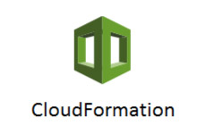

### AWS CloudFormation Templates

1. **autoscale-healthyhost-template.json**

  * CloudWatch and AutoScaling work together to monitor ELB/instances and maintain the total number of desired instances in the pool.

2. **bastion-template.json**

  * Bastion host on-demand. Launch a bastion (jump host) into a public subnet to access your VPC via SSH.  Terminate the server when unused.

3. **cloudwatch-iam-alarms-template.json** 

  * Creates CloudTrail IAM API activity alarms for CloudWatch logs.

4. **elasticache-template.json**

  * Creates an ElastiCache cluster in a VPC.

5. **elb-template.json**

  * Secure public facing SSL ELB template.  Create and manage your SSL cipher policy.

6. **iam-poweruser-template.json**

  * Creates an IAM "power user" group and inline policy.

7. **nat-instance-template.json**

  * Deploys a NAT instance with the option for enhanced network capabilities into a public subnet.

8. **rds-replica-template.json**

  * Create a multi-AZ provisioned IOps RDS instance with an optional read replica.

9. **s3-logging-bucket.json**

  * Create a S3 logging bucket, bucket policy and retension policy in the region the stack is launched in.

10. **vpc-2az-natgw-template.json**

  * Creates a VPC with AWS NAT Gateways in 2 availability-zones, 4-6 subnets (optional Db subnet tier).

11. **vpc-2az-template.json**

  * Creates a VPC with Managed NAT instances in 2 availability-zones, 4-6 subnets (optional Db subnet tier).
  * https://s3-us-west-2.amazonaws.com/toddm92/public/diagrams/vpc-2az-diagram.jpg

12. **vpc-beanstalk-template.json**

  * Creates a VPC with four subnets in two availability zones. Launches an Elastic Beanstalk environment.
  * https://s3-us-west-2.amazonaws.com/toddm92/public/diagrams/vpc-beanstalk-env.jpg

13. **vpc-elasticache-template.json**

  * Creates a VPC with four subnets in two availability zones. Calls the *elasticache-template.json* nested stack.

===

**Build an entire AWS environment with Templates:**

https://github.com/toddm92/mock-aws-env

